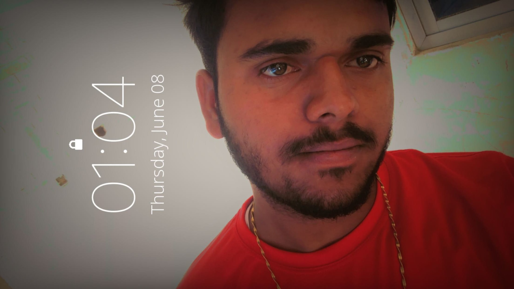

<html>
<head>
    
</head>
<body>
    <header>
        <h1>Namaste! Main Bipin Kumar Singh </h1>
        
        
Yeh meri pehli personal website hai.

    </header>

    <section>
        <h2>Mere baare mein</h2>
        
Main ek beginner hoon jo website banana seekh raha hoon. Mera shauk hai naye skills seekhna.

    </section>

    <section class="social-links">
        <h2>Social Media</h2> |
        <a href="https://www.instagram.com/ibipinks" target="_blank">Instagram</a> |
        <a href="https://www.facebook.com/share/1E6QoZU8FD/" target="_blank">Facebook</a> |
        <a href="https://twitter.com/BIPINKUMAR30515" target="_blank">Twitter</a> |
        <a href="https://www.youtube.com/@BipinKumarSingh-j4p" target="_blank">YouTube</a> |
    </section>
    
 <section>

    

    <h2>Donate Karein</h2>
    
Support ke liye aap mujhe donation bhej sakte hain:

    
<strong>UPI ID:</strong> bipinkumaronline9095@okicici

    
<strong>Mobile No:</strong> 8210716951

    
<strong>Qr Code:</strong>
 

 </section> 
<section>
 	
        <h2>Contact</h2> 
        
<strong>Mobile No:</strong> +918210716951

	
<strong>Email Id:</strong> bipinkumaronline9095@gmail.com

 </section>

    <footer>
        &copy; 2025 Bipin Kumar Singh 
    </footer>
</body>
</html>
